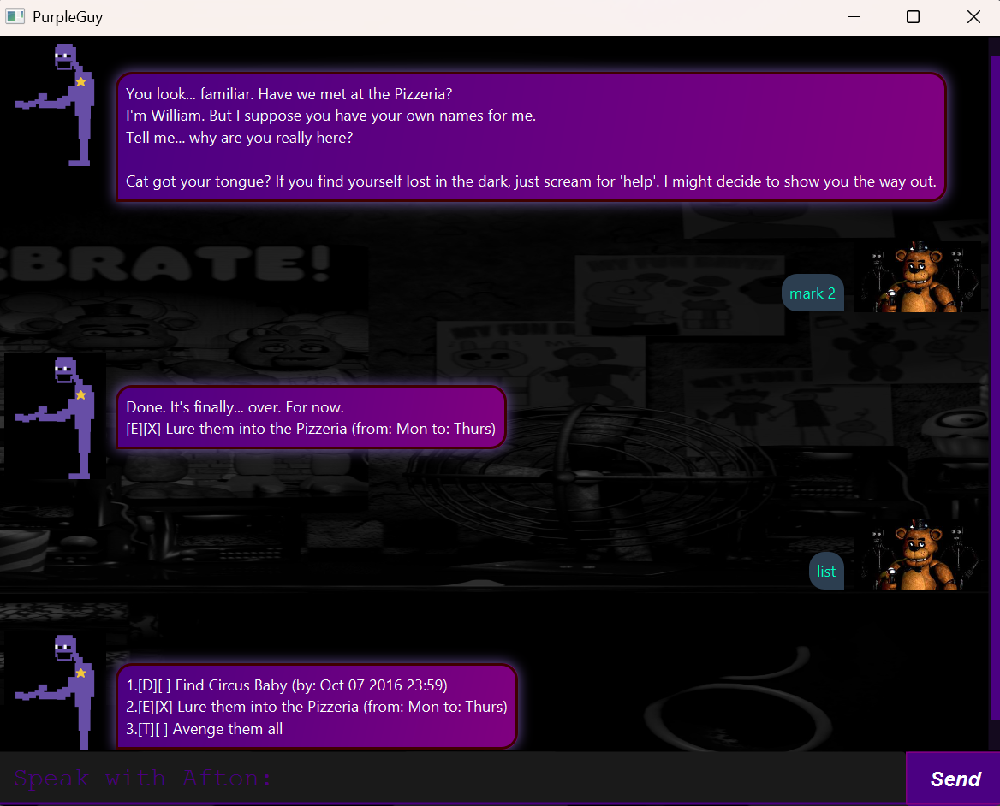

# PurpleGuy User Guide



PurpleGuy is a task management desktop app, themed upon a certain popular indie horror villain. It stores task information locally and is optimised for use via a Graphical User Interface (GUI)

## Adding Todo

Add a task to the list

Format: `todo NAME`

Example: 
```
todo Get Mike's birthday gift
```
Outcome: Creates a Deadline task with the name and deadline specified

## Adding Deadlines

Add a task with a deadline

Format: `deadline NAME /by yyyy-MM-dd HH:mm`

Example: 
```
deadline Finish Meal Prep /by 2026-02-15 17:00
```
Outcome: Adds a task with the name and deadline specified to the list


## Feature ABC

// Feature details


## Feature XYZ

// Feature details
